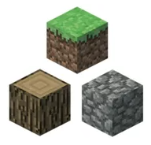

# Minecraft Buildpack

This is a [Cloud Native Buildpack](https://buildpacks.io) for Minecraft. It produces a Docker image you can use to run a Minecraft server.



Do not confuse it with the [Heroku Minecraft Buildpack](https://github.com/jkutner/heroku-buildpack-minecraft/), which uses an older Buildpack API.

## Usage

First, install the [Pack CLI](https://buildpacks.io/docs/tools/pack/). Then run:

```
$ mkdir minecraft-app
$ cd minecraft-app
$ pack build --builder jkutner/minecraft-builder:18 minecraft-app
```

Create a [free ngrok account](https://ngrok.com/) and copy your [Your Authtoken](https://dashboard.ngrok.com/auth/your-authtoken). Then run the server with a command like:

```
$ docker run -e NGROK_API_TOKEN="<token>" -p 8080:8080 -it minecraft-app
```

Open a browser to `http://localhost:8080`, which will display the address of the server (really it's a proxy, but whatever):

```
Server available at: 0.tcp.ngrok.io:17003
```

Copy the `0.tcp.ngrok.io:17003` part. Then open Minecraft, and select "Multiplayer" and "Direct Connection". Paste the address as the "Server Address" and click "Join Server".


## Syncing to S3

By default, the server will only store your world files in the Docker container. But these files will be lost when the container is destroyed.

To permenantly store your world file, you can enable syncing to an [AWS S3 bucket](https://aws.amazon.com/s3/). Minecraft keeps all of the data for the server in flat files on the file system. Thus, if you want to keep you world, you'll need to sync it to S3.

First, create an [AWS account](https://aws.amazon.com/) and an S3 bucket. Then, you'll need to add the `s3cmd` tool to your image. Run the following commands:

```
$ echo "s3cmd" > requirements.txt
$ pack build --builder jkutner/minecraft-builder:18 minecraft-app
```

Finally configure the bucket and your AWS keys by adding them as environment variables to your Docker command, like this:

```
$  docker run \
      -e AWS_BUCKET=your-bucket-name\
      -e AWS_ACCESS_KEY=xxx \
      -e AWS_SECRET_KEY=xxx \
      ...
```

The buildpack will sync your world to the bucket every 60 seconds, but this is configurable by setting the `AWS_SYNC_INTERVAL` environment variable. You can also customize the [`s3cmd` options](https://s3tools.org/usage) by setting the `S3CMD_OPTIONS` environment variable.

## Using Spigot or Forge

Instead of installing the standard Minecraft distribution from Mojang, you can choose [Forge](https://files.minecraftforge.net/) or [Spigot](https://www.spigotmc.org) by setting the `MINECRAFT_DIST` env var at build time. For example:

```
$ pack build -e MINECRAFT_DIST="spigot" ...
```

The valid values are `spigot` and `forge`. Any other value will install the standard Minecraft distribution.

## Customizing

You can choose the Minecraft version by setting the `MINECRAFT_VERSION` during build, like this:

```
$ pack build -e MINECRAFT_VERSION="1.16.4" minecraft-app
```

Known versions are stored in the [files.json](https://github.com/jkutner/minecraft-buildpack/blob/master/minecraft/files.json). Please submit a PR to add new versions.

You can change your server properties by adding [standard Minecraft configuration files](https://minecraft.gamepedia.com/Server.properties) to the same directory that you run the `pack build` command. For example, you can change operator privileges by creating an `ops.json` like this:

```json
[
  {
    "uuid": "1234567-1234-abab-1c1c-2i13uhiifwu",
    "name": "username",
    "level": 4
  }
]
```

Or you can can allow certain users by creating a `whitelist.json` like this:

```json
[
  {
    "uuid": "1234567-1234-abab-1c1c-2i13uhiifwu",
    "name": "username"
  }
]
```

Or you can customize the gameplay by creating a [`server.properties`](https://minecraft.gamepedia.com/Server.properties) like this:

```
gamemode=1
difficulty=1
pvp=false
```

After creating or modifying these files, you must run `pack build` again (in the same directory as the files to modified). See the [example directory](https://github.com/jkutner/minecraft-buildpack/tree/master/example) for a more complete setup.

### ngrok

You can customize ngrok by setting the `NGROK_OPTS` config variable. For example:

```
$ docker run -e NGROK_OPTS="--remote-addr 1.tcp.ngrok.io:25565" ...
```

## Connecting to the server console

The Minecraft server runs inside a `screen` session. Once you've started a server with `docker run`, you can use `docker exec` to connect to your server console. Get the container ID by running `docker ps`, and then start a console like this:

```
$ docker exec -it <container-id> launcher screen -r minecraft
```

**WARNING**: You are now connected to the Minecraft server. Use `Ctrl-A Ctrl-D` to exit the screen session.
(If you hit `Ctrl-C` while in the session, you'll terminate the Minecraft server.)

## License

MIT
